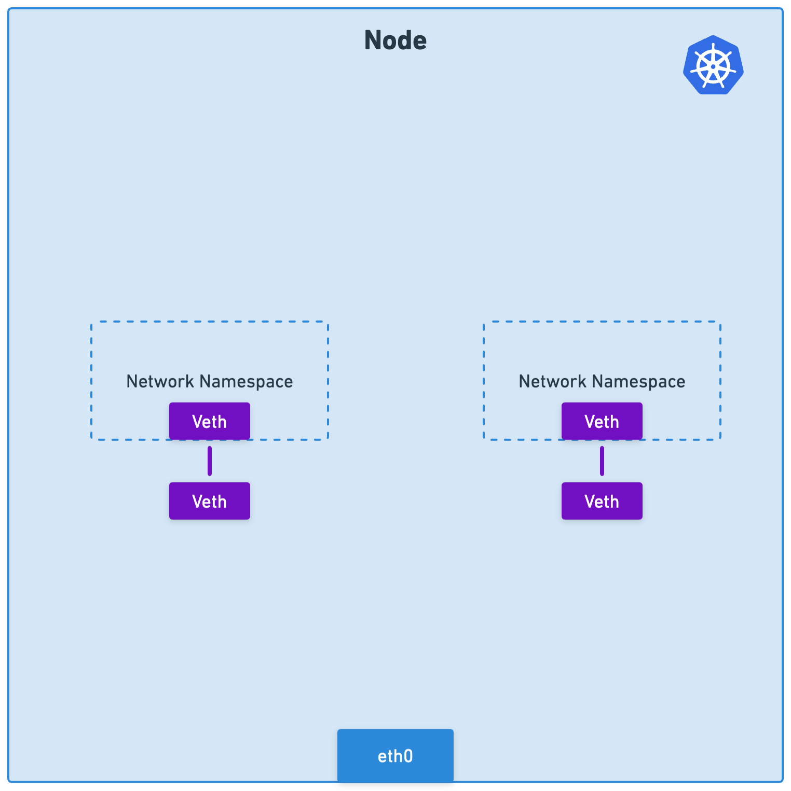
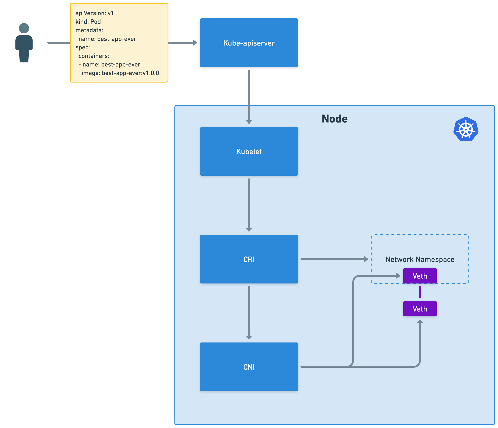
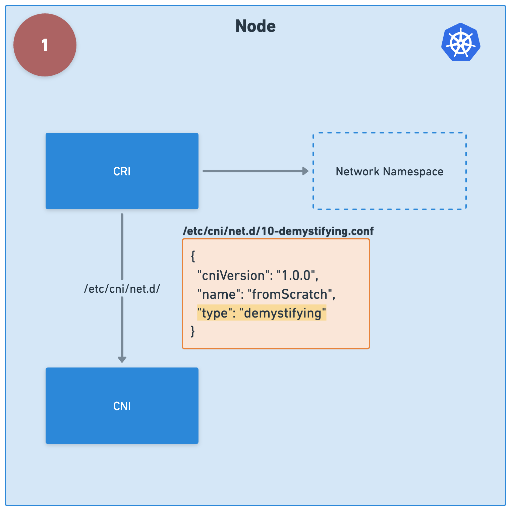
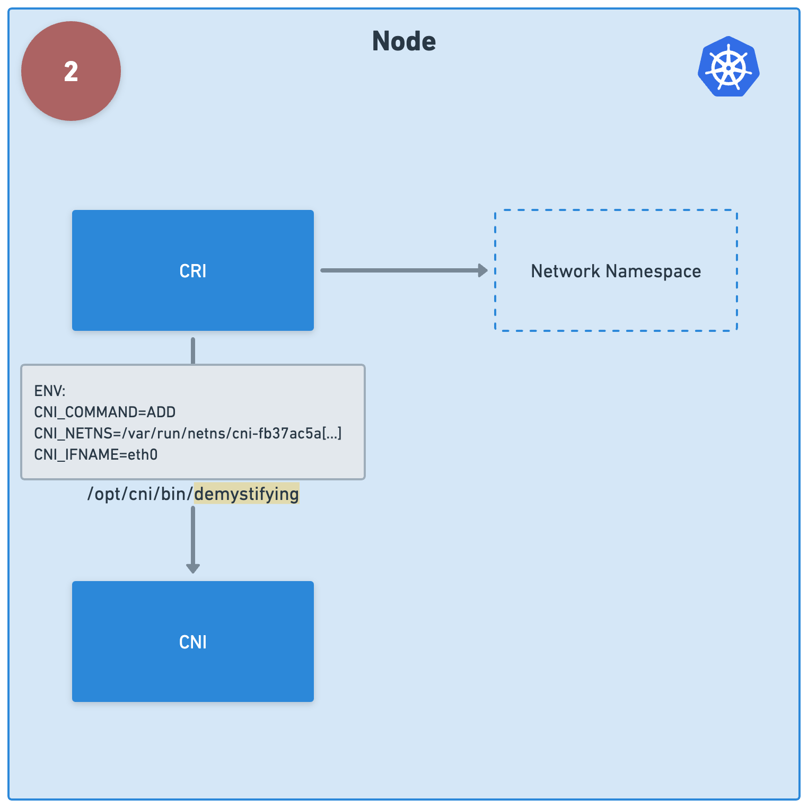
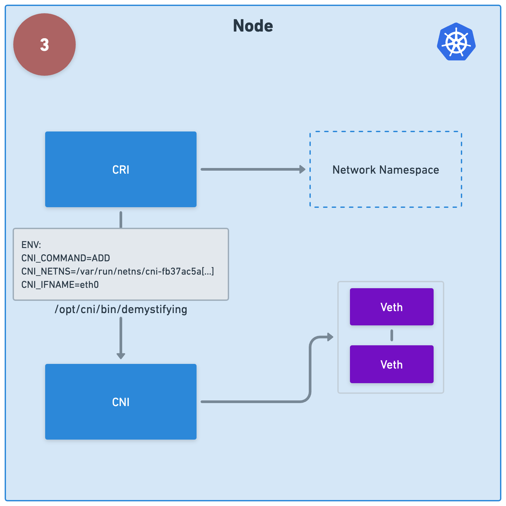
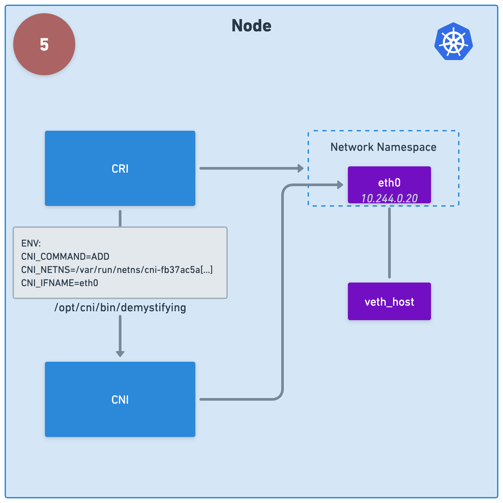
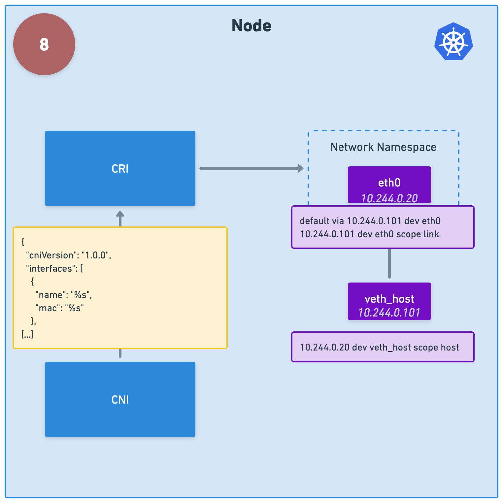

# Introduction

The Cilium project recently became a graduated CNCF project and is the only graduated project in the CNCF Cloud Native Networking category.
While Cilium can do many things - Ingress, Service Mesh, Observability, Encryption - its popularity initially soared as a pure CNI: a high-performance feature-rich Container Network plugin.
However, we may actually take for granted what CNI actually means.
In this blog post, we will demistify what a CNI does and even build a CNI from scratch.
By the end of this post, you will have built your own homemade alternative to Cilium.

## What Is a Container Network Interface (CNI)?

The Container Network Interface (CNI) is a CNCF project that specifies the relationship between a Container Runtime Interface (CRI), such as containerd, responsible for container creation, and a CNI plugin tasked with configuring network interfaces within the container upon execution.
Ultimately, it's the CNI plugin that performs the substantive tasks, while CNI primarily denotes the interaction framework.
However, it's common practice to simply refer to the CNI plugin as "CNI", a convention we'll adhere to in this post.

## Container Networking Explained

Containers do not possess their own kernel, instead they rely on the kernel of the host system on which they are running.
This design choice renders containers more lightweight but less isolated compared to Virtual Machines (VMs).
To provide some level of isolation, containers utilize a kernel feature known as namespaces.
These namespaces allocate system resources, such as interfaces, to specific namespaces, preventing those resources from being visible in other namespaces of the same type.

> Note that namespaces are referring to Linux namespaces, a Linux kernel feature and have nothing to do with Kubernetes namesapces.

While containers consist of various namespaces, we will concentrate on the network namespace for the purposes of this blog.
Typically each container has its own network namespace.
This isolation ensures that interfaces outside of the container's namespace are not visible within the container's namespace and processes can bind to the same port without conflict.

To facilitate networking, containers employ a specialized device known as a virtual ethernet device (veth).
Veth devices are always created in interconnected pairs, ensuring that packets reaching one end are transmitted to the other, similar to two systems being linked via a cable.

To enable communication between a container and the host system one of the veth interfaces resides within the container's network namespace, while the other resides within the host's network namespace.
This configuration allows seamless communication between the container and the host system.
As a result containers on the same node are able to communicate with each other through the host system.



## How does a CNI work?

Picture a scenario where a user initiates the creation of a Pod and submits the request to the kube-apiserver.
Following the scheduler's determination of the node where the Pod should be deployed, the kube-apiserver contacts the corresponding kubelet.
The kubelet, rather than directly creating containers, delegates this task to a CRI.
The CRI's responsibility encompasses container creation, including the establishment of a network namespace, as previously discussed.
Once this setup is complete, the CRI calls upon a CNI plugin to generate and configure virtual ethernet devices and necessary routes.



> Please note that a that CNIs typically do not handle traffic forwarding or load balancing.
> By default, kube-proxy serves as the default network proxy in Kubernetes which utilizes technologies like iptables or IPVS to direct incoming network traffic to the relevant Pods within the cluster.
> However, Cilium offers a superior alternative by loading eBPF programs directly into the kernel, achieving the same tasks with significantly higher speed.
> Further information on Cilium's kube-proxy replacement can be found [here](https://docs.cilium.io/en/stable/network/kubernetes/kubeproxy-free/).

## Writing a CNI from scratch

A common misconception suggests that Kubernetes-related components must be coded exclusively in Go.
However, CNI dispels this notion by being language agnostic, focusing solely on defining the interaction between the CRI and a CNI plugin.
The language used is inconsequential, what matters is that the plugin is executable.
To demonstrate this flexibility, we'll develop a CNI plugin using bash.

Before delving into the implementation, let's examine the steps in more detail:

1. Following the CRI's creation of a network namespace, it will load the first file located in `/etc/cni/net.d/`. Therefore, we'll generate a file named `/etc/cni/net.d/10-demystifying.conf`. This file must adhere to a specific JSON structure outlined in the CNI specification. The line `"type": "demystifying"` indicates the presence of an executable file named demystifying, which the CRI will execute in the next step.



2. The CRI will search in the directory `/opt/cni/bin/` and execute our CNI plugin, `demystifying`. For that reason we will create our bash script at `/opt/cni/bin/demystifying`. When the CRI invokes a CNI plugin, it passes data to the executable: the JSON retrieved from the previous step is conveyed via STDIN, while details about the container, including the relevant network namespace indicated by `CNI_NETNS`, are conveyed as environment variables.



3. The first task our CNI plugin has to achieve is to create a virtual ethernet device. This action results in the creation of two veth interfaces, which we'll subsequently configure. One of the interfaces will be named `veth_netns` and the other one `veth_host` to make it easier to follow further steps.



4. Next, we'll move one of the veth interfaces, `veth_netns`, into the container's network namespace. This allows for a connection between the container's network namespace and the host's network namespace.


5. While the veth interfaces are automatically assigned MAC addresses, they lack an IP address. Typically, each node possesses a dedicated CIDR range, from which an IP address is selected. Assigning an IP to the veth interface inside the container network namespace is what is considered to be the Pod IP. For simplicity, we'll statically set `10.244.0.20` as the IP address and rename the interface based on the `CNI_IFNAME` environment variable. Keep in mind that Pod IPs must be unique in order to not create routing issues further down the line. In reality one would therefore keep track of all assigned IPs, a detail that we are skipping for simplicity reasons.



6. The veth interface on the host will receive another IP address, serving as the default gateway within the container's network namespace.We'll statically assign `10.244.0.101` as the IP address. Irrespective of the number of Pods created on the node this IP can stay the same as its sole purpose is to serve as a destination for a route within the container's network namespace.


7. Now it is time to add routes. Inside the container's network namespace, we need to specify that all traffic should be routed through `10.244.0.101`, directing it to the host. On the host side all traffic destined for `10.244.0.20` must be directed through `veth_host`. This configuration achieves bidirectional communication between the container and the host.


8. Finally, we need to inform the CRI of our actions. To accomplish this, we'll print a JSON via STDOUT containing various details about the configuration performed, including the interfaces and IP addresses created.



With that we have to create two files.

The first one will be `/etc/cni/net.d/10-demystifying.conf`:
```
{
  "cniVersion": "1.0.0",
  "name": "fromScratch",
  "type": "demystifying"
}
```

The second one being the executable CNI plugin `/opt/cni/bin/demystifying`:
```
#!/usr/bin/env bash

# create veth
VETH_HOST=veth_host
VETH_NETNS=veth_netns
ip link add ${VETH_HOST} type veth peer name ${VETH_NETNS}

# put one of the veth interfaces into the new network namespace
NETNS=$(basename ${CNI_NETNS})
ip link set ${VETH_NETNS} netns ${NETNS}

# assign IP to veth interface inside the new network namespace
IP_VETH_NETNS=10.244.0.20
CIDR_VETH_NETNS=${IP_VETH_NETNS}/32
ip -n ${NETNS} addr add ${CIDR_VETH_NETNS} dev ${VETH_NETNS}

# assign IP to veth interface on the host
IP_VETH_HOST=10.244.0.101
CIDR_VETH_HOST=${IP_VETH_HOST}/32
ip addr add ${CIDR_VETH_HOST} dev ${VETH_HOST}

# rename veth interface inside the new network namespace
ip -n ${NETNS} link set ${VETH_NETNS} name ${CNI_IFNAME}

# ensure all interfaces are up
ip link set ${VETH_HOST} up
ip -n ${NETNS} link set ${CNI_IFNAME} up

# add routes inside the new network namespace so that it knows how to get to the host
ip -n ${NETNS} route add ${IP_VETH_HOST} dev eth0
ip -n ${NETNS} route add default via ${IP_VETH_HOST} dev eth0

# add route on the host to let it know how to reach the new network namespace
ip route add ${IP_VETH_NETNS}/32 dev ${VETH_HOST} scope host

# return a JSON via stdout
RETURN_TEMPLATE='
{
  "cniVersion": "1.0.0",
  "interfaces": [
    {
      "name": "%s",
      "mac": "%s"
    },
    {
      "name": "%s",
      "mac": "%s",
      "sandbox": "%s"
    }
  ],
  "ips": [
    {
      "address": "%s",
      "interface": 1
    }
  ]
}'

MAC_HOST_VETH=$(ip link show ${VETH_HOST} | grep link | awk '{print$2}')
MAC_NETNS_VETH=$(ip -netns $nsname link show ${CNI_IFNAME} | grep link | awk '{print$2}')

RETURN=$(printf "${RETURN_TEMPLATE}" "${VETH_HOST}" "${MAC_HOST_VETH}" "${CNI_IFNAME}" "${mac_netns_veth}" "${CNI_NETNS}" "${CIDR_VETH_NETNS}")
echo ${RETURN}
```

As the CNI plugin must be executable, we'll need to modify the file mode using `chmod +x /opt/cni/bin/demystifying`.
Admittedly, this setup isn't production-ready and has several limitations.
Nonetheless, it offers insight into the workings of a CNI.
